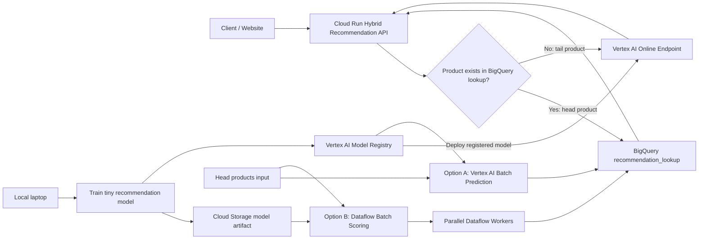

# Hybrid Recommendation Serving on GCP

This project demonstrates a **hybrid ML serving architecture** on Google Cloud Platform using both:

- **Static batch serving** for high-traffic head products
		- using FastAPI container and Vertex AI Endpoint
- **Dynamic online serving** for long-tail products
		- Option A:  using Vertex AI Batch Inference
		- Option B:  using Dataflow and loading model into workers memory
		

The use case is an e-commerce recommendation system. Popular products are precomputed and stored in BigQuery for low-latency lookup, while less common products fall back to a Vertex AI online endpoint that computes recommendations on demand.

## Objective

Build a practical GCP MLOps portfolio project that shows how batch and online serving can work together in one production-style system.

The main serving behavior is:

```text
Client request
    -> Cloud Run API
        -> Check BigQuery batch lookup table
            -> If found, return precomputed recommendations
            -> If not found, call Vertex AI online endpoint
```

## Business Use Case

Imagine an e-commerce website where customers browse product pages or add items to cart. The website needs to show similar products quickly.

For the most popular products, recommendations are generated ahead of time using batch processing. This keeps latency low and predictable.

For long-tail products, storing precomputed recommendations for every product may be expensive or unnecessary. These products are served dynamically using an online model endpoint.

## Architecture




## Why Hybrid Serving?

| Serving Mode | Used For | Advantages | Tradeoffs |
|---|---|---|---|
| Static batch serving | Popular head products | Low latency, predictable response time, less online compute | Requires precomputation and storage |
| Dynamic online serving | Long-tail products | Flexible, handles rare or unseen requests | Higher latency and compute cost per request |

## GCP Services Used

| Service | Purpose |
|---|---|
| Vertex AI Model Registry | Register the custom model container |
| Vertex AI Endpoint | Serve dynamic online recommendations |
| Vertex AI Batch Prediction | Option A for managed batch inference |
| Dataflow | Option B for custom distributed batch scoring |
| BigQuery | Store product data and batch recommendation lookup tables |
| Cloud Run | Host the hybrid router API |
| Cloud Storage | Store input data, batch files, and model artifact |
| Artifact Registry | Store Docker images |
| Cloud Build | Build container images |

## Model Approach

This project uses a small nearest-neighbor recommendation model.

The model uses product metadata such as:

- category
- brand
- price
- rating

It returns the top similar products for a given `product_id`.

The goal of the project is not model accuracy. The goal is to demonstrate production-style ML serving patterns using GCP.

## Repository Structure

```text
hybrid-recommendation-serving/
  api/
    main.py
    requirements.txt
    Dockerfile

  data/
    products.csv
    head_products.csv
    tail_products.csv

  dataflow/
    batch_score.py
    requirements.txt

  serving/
    app.py
    requirements.txt
    Dockerfile

  sql/

  src/
    __init__.py
    generate_products.py
    train_model.py
    generate_batch_input.py
    recommendation_model.py
    test_recommendation_model.py

  setup.py
  cloudbuild.yaml
  cloudbuild-api.yaml
  README.md
```

## Data Flow

1. Generate a synthetic product catalog locally.
2. Split products into head products and tail products.
3. Train a small nearest-neighbor recommendation model.
4. Save the model artifact as `model.joblib`.
5. Upload data and model artifact to Cloud Storage.
6. Create BigQuery tables for products and head products.
7. Build and push the Vertex AI serving container.
8. Register the container in Vertex AI Model Registry.
9. Deploy the model to a Vertex AI Endpoint.
10. Run Vertex AI Batch Prediction for head products.
11. Load batch prediction output into BigQuery.
12. Deploy a Cloud Run API that routes between BigQuery and Vertex AI.
13. Run a Dataflow batch scoring pipeline as an alternative batch implementation.

## Batch Option A: Vertex AI Batch Prediction

Vertex AI Batch Prediction is the managed batch inference option.

Input:

```text
gs://hybrid-rec-demo-varun/batch-input/head_products.jsonl
```

Output:

```text
gs://hybrid-rec-demo-varun/batch-output/vertex-option-a/
```

The output is loaded into BigQuery as:

```text
hybrid_rec.recommendation_lookup
```

This option is simpler and more GCP-native because Vertex AI manages the batch prediction infrastructure.

## Batch Option B: Dataflow Batch Scoring

Dataflow is the custom distributed batch scoring option.

The Dataflow pipeline:

1. Reads head products from BigQuery.
2. Starts Dataflow workers.
3. Each worker downloads `model.joblib` from Cloud Storage.
4. Each worker loads the model locally.
5. Workers score products in parallel.
6. Results are written to BigQuery.

Output table:

```text
hybrid_rec.recommendation_lookup_dataflow
```

This option is useful when batch scoring requires custom preprocessing, custom joins, enrichment logic, or more control over the distributed pipeline.

## Online Serving

The online serving path uses:

```text
Vertex AI Endpoint
    -> FastAPI custom prediction container
    -> model.joblib
```

The container exposes:

```text
GET /health
POST /predict
```

Example request:

```json
{
  "instances": [
    {
      "product_id": "P00042",
      "top_k": 5
    }
  ]
}
```

Example response:

```json
{
  "predictions": [
    {
      "product_id": "P00042",
      "recommendations": [
        {
          "recommended_product_id": "P00123",
          "title": "Nova Electronics Item 123",
          "category": "electronics",
          "brand": "Nova",
          "similarity_score": 0.98
        }
      ],
      "error": null
    }
  ]
}
```

## Hybrid Cloud Run API

The Cloud Run API exposes:

```text
GET /recommendations/{product_id}?top_k=5
```

For head products, it returns recommendations from BigQuery:

```json
{
  "product_id": "P00042",
  "source": "batch_bigquery",
  "recommendations": []
}
```

For tail products, it calls Vertex AI online prediction:

```json
{
  "product_id": "P00999",
  "source": "online_vertex_ai",
  "recommendations": []
}
```

## Key Design Decisions

### Why Cloud Run?

Cloud Run is used as the hybrid router because it is simple, serverless, and can scale to zero. It keeps the routing layer separate from the model serving layer.

### Why Vertex AI Endpoint?

Vertex AI Endpoint is used for online model serving. It provides a managed serving platform for dynamic predictions.

### Why FastAPI?

FastAPI is used inside the custom prediction container because the response is a custom top-k recommendation payload, not a simple single-label prediction.

### Why BigQuery?

BigQuery acts as the batch recommendation lookup table. Head product recommendations can be read quickly without recomputing the model.

### Why Dataflow?

Dataflow demonstrates a custom distributed batch scoring approach. It is useful when batch inference needs custom logic beyond a managed batch prediction job.

## Cost Control

This project was intentionally designed to stay small:

- Synthetic dataset with around 1,000 products
- Head products limited to around 20%
- Vertex AI endpoint deployed with one node only
- Dataflow limited to one starting worker and two maximum workers
- Cloud Run used for scale-to-zero API serving
- Small Docker images and small model artifact
- Cleanup performed after testing

## Screenshots 

[Project Screenshots here - Step by Step implementation](project_screenshots/)

## Step by Step - how to?

[Step by Step Instruction - How to implement?](steps.txt)